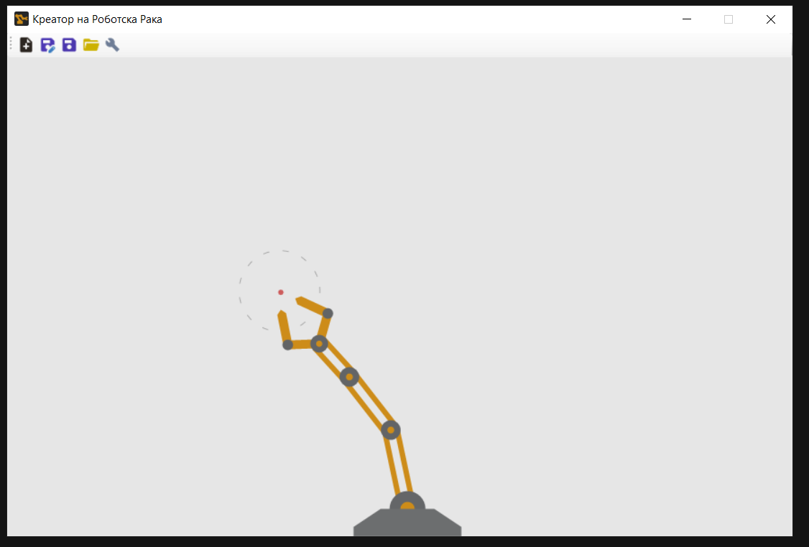
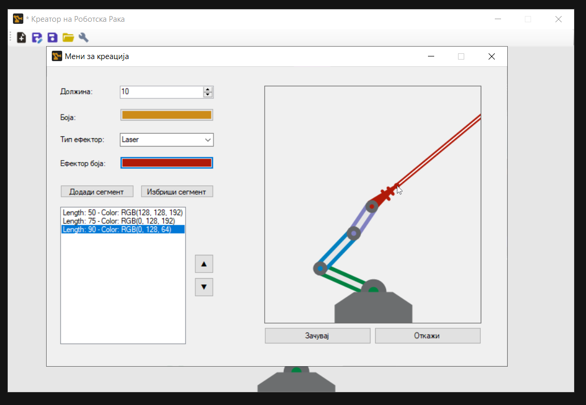

# Креатор на роботска рака - Вељко Аџиќ

Ова апликација овозможува на корисникот да изгради роботска рака од различни сегменти и додатоци, и да ја истестира во симулираната околина. Апликацијата содржи мени за изградба каде корисникот може да додава и брише сегменти, да ги поместува нивните позиции, и да управува со крајниот ефектор.

Во главниот формулар се извршува симулацијата каде раката го следи курсерот или движечко топче кое се одбива од рабовите. Корисникот дополнително може да го активира крајниот ефектор ако го претисне копчето на глувче.
Апликацијата исто така може да ги зачувува и вчитува креираните роботи во .rarm датотеки.

Овој проект е инспириран и базиран на ова [видео за инверзна кинематика](https://www.youtube.com/watch?v=RTc6i-7N3ms).

## Упатство



<br>

Кога прв пат се вклучи апликацијата (прикажано на Сл.1) вчитан е стандардниот робот со 3 сегменти и пипало. Во горната лента има повеќе копчиња кои ни овозмоќуваат да креира нов робот, да се зајува во датотека, да се вчита од датотека, и да се едитира сегашниот робот.

Доколку курсерот е во прозорецот раката ќе го следи каде и да се движи. Ако корисникот го претисни левот копче на глувче крајниот ефектор ќе се активира. Кога курсерот го напушти прозорецот раката преминува да следи топче кое се движи низ прозорецот, одбивајќи се од рабовите.

### Сереализација

**Зачувување** на робот во дадотека се извршува со кликање на едно од двете сини копчиња од лентата. Синото копче со пенкалото секогаш го залувува роботот како нова дадотека, а другото сино копче без пенкало го зачувува во веќе отворена датотека.
**Вчитување** на робот од датотека се врши со клик на копче со жолта папка каде од фајл менаџер се избира датотека со „.rarm“ екстензија.

### Креирање и менување на робот

Може да се отвори **мени за креација** (прикажано во Сл.2) кога се претисне плус копчето најлево или копчето со клуч најдесно на лентата. Во овој формула на левата страна има полиња за креирање на сегмент и менување на поставувае краен ефектор; на десната страна има панел за преглед на раката.

**Додавање сегмент** на роботот се врши така што прво се поставува должината и бојата на сегментот, па се кликнува копчето „Додади сегмент“ каде се додава на врвот под ефекторот. **Поместување селектиран сегмент** се врши со копчињата со стрелки до листата.
**Бришење на сегмент** се врши на сличен начин каде што се селектира сегмент од листата и се претиснува копчето „Избричи сегмент“.

Бојата на краен ефектор може да се постави со копчето **Ефектор боја**, а тип на ефекторот може да се одбере од опаѓачкото мени. Ефекторот може да биде од тип **пипало** (Grabber) или **ласер** (Laser).

## Решение на проблемот

Главните податоци и функционалности се чуваат во класите `Robot`, `Segment` и во главниот формулар `MainForm`.

### MainForm имплементација

Во `MainForm` се чува роботот кој се симулира, локација на дадотека (ако не е отворена датотека се поставува на `null`, и знаменци за дали роботот бил модифиран)

```csharp
public partial class MainForm : Form
{
    public Robot Rob { get; set; }
    public String FileLocation { get; set; }
    public bool Modified { get; set; }
}
```

Со овие функции се контролира однесувањето на роботот. Кога тајмерот изврши такт роботот го следи топчето, а кога глувшето се движи го следи курсерот.

```csharp
private void timer1_Tick(object sender, EventArgs e)
{
    Rob.Update();
    Invalidate();
}

private void MainForm_MouseMove(object sender, MouseEventArgs e)
{
    Rob.Update(e.X, e.Y);
    Invalidate();
}

private void MainForm_MouseLeave(object sender, EventArgs e)
{
    Rob.BallUpdate();
    timer1.Start();
}

private void MainForm_MouseEnter(object sender, EventArgs e)
{
    timer1.Stop();
}
```

Овие две функции вршат JSON серелизација на роботот. Користено е `JsonSerializer` наместо `BinaryFormatter` поради тоа што BinaryFormatter има грешка во неговата имплементација што се појави за серелизација на роботот. Грешката се појавуваше во десереализација на листа од сегменти каде од датотекасе добива листа со точна големина, но со `null` елементи. Заради тоа се користи JsonSerializer.

```csharp
private void saveToFile()
{
    if(FileLocation == null)
    {
        SaveFileDialog sfd = new SaveFileDialog();
        sfd.Filter = "Robot Arm File (*.rarm)|*.rarm";
        sfd.Title = "Зачувај Робот";
        if(sfd.ShowDialog() == DialogResult.OK)
        {
            FileLocation = sfd.FileName;
        }
    }

    if( FileLocation != null)
    {
        using(FileStream fs = new FileStream(FileLocation, FileMode.OpenOrCreate, FileAccess.Write))
        {
            JsonSerializer.Serialize<Robot>(fs, this.Rob);
        }

        this.Modified = false;
    }
}

private void loadFromFile()
{
    if(FileLocation == null)
    {
        OpenFileDialog ofd = new OpenFileDialog();
        ofd.Filter = "Robot Arm File (*.rarm)|*.rarm";
        ofd.Title = "Вчитај Робот";

        if (ofd.ShowDialog() == DialogResult.OK)
        {
            FileLocation = ofd.FileName;
        }
    }

    if(FileLocation != null)
    {
        try
        {
            Robot newRob;
            using (FileStream fs = new FileStream(FileLocation, FileMode.Open, FileAccess.Read))
            {
                newRob = JsonSerializer.Deserialize<Robot>(fs);
            }
            this.Rob.BuildFrom(newRob.Segments, newRob.EndEffector);
            this.Modified = false;
        } catch (Exception e)
        {
            MessageBox.Show(e.Message);
        }
    }
}
```

### Robot имплементација

Во класа `Robot` се чуваат овие параметри. Сите параметри означени со `[JsonIgnore]` не се сереализираат. Параметарот `Base` го има `[JsonConverter(typeof(JsonVec2Converter))]` бидејќи `Vector2` класата нема имплементација за серелизација во JSON. Класата `DummyBall` ја содржи имплементацијата на топчето кое роботот го следи.

```csharp
public class Robot
{
    public List<Segment> Segments { get; set; }
    public int Length { get; set; }
    [JsonConverter(typeof(JsonVec2Converter))]
    public Vector2 Base { get; set; }
    [JsonIgnore]
    public bool FollowMouse { get; set; } = false;
    [JsonIgnore]
    public DummyBall Ball { get; set; }
    public int Width { get; set; }
    public int Height { get; set; }
    [JsonIgnore]
    public bool PreviewMode { get; set; } = false;
    public Effector EndEffector { get; set; }
    [JsonIgnore]
    public List<Segment> AllSegments { get; set; }
}
```

## Користени ресурси

AI и информации...
